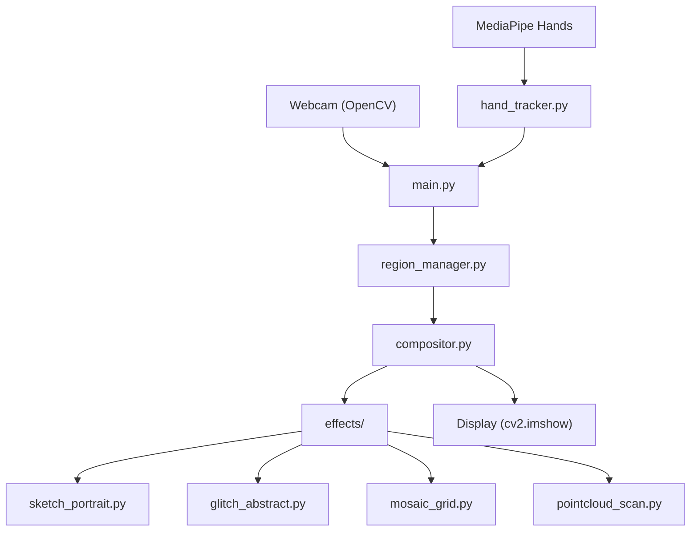

# Project Overview — Gesture-Triggered Generative Visual Art

<cite>
**Referenced Files**
- [master_prompt_gesture_visual.md](file://Prompt/master_prompt_gesture_visual.md)
- [Frame Prototype/](file://Frame%20Prototype/)
</cite>

## Table of Contents
1. [Introduction](#introduction)
2. [Visual Reference Analysis (Frame Prototype)](#visual-reference-analysis)
3. [Effect Taxonomy](#effect-taxonomy)
4. [Architecture Overview](#architecture-overview)
5. [Implementation Roadmap](#implementation-roadmap)
6. [Conclusion](#conclusion)

## Introduction

This project is a **real-time interactive generative art** application written in Python. It captures a live webcam feed, performs hand tracking via MediaPipe to detect **pinch gestures** (thumb tip + index finger tip), and spawns locked rectangular "regions" on the canvas at the pinch location. Each region renders a distinct generative visual effect in real-time, overlaid on the webcam feed. No audio — purely visual and gesture-driven.

The visual style references a TouchDesigner prototype (captured as 300 frames in `Frame Prototype/`) that demonstrates four core effects: sketch portrait, glitch abstract, mosaic grid, and point cloud depth scan.

## Visual Reference Analysis

The `Frame Prototype/` folder contains **300 PNG frames** extracted from a screen recording of a TouchDesigner project (`project1/jul18`). The recording runs at **60 FPS** with a canvas of **1372×772 px**, capturing approximately **10 seconds** of live generative art interaction.

```mermaid
graph LR
    A["Frames 1-30"] --> B["Raw Webcam + Tracking"]
    B --> C["Frames 30-60"]
    C --> D["Region Spawn + Tracking Box"]
    D --> E["Frames 60-120"]
    E --> F["Sketch Portrait Effect"]
    F --> G["Frames 120-170"]
    G --> H["Glitch Abstract Effect"]
    H --> I["Frames 170-220"]
    I --> J["Mosaic Grid Effect"]
    J --> K["Frames 220-270"]
    K --> L["Point Cloud / Depth Scan"]
    L --> M["Frames 270-300"]
    M --> N["Closing / Peace Sign"]
```

### Frame-by-Frame Breakdown

| Frame Range | Timecode (approx.) | Visual Content | Corresponding Effect |
|---|---|---|---|
| 001–030 | 00:00:00–00:00:30 | Person in front of webcam, hands gesturing, white tracking rectangle appears | Raw feed + region spawn |
| 030–060 | 00:00:30–00:01:28 | White-bordered region locked, person raises hands, tracking active | Region lock + initial state |
| 060–120 | 00:01:28–00:02:28 | Faint sketch lines appear inside region, progressive edge-based face rendering | **Sketch Portrait** |
| 120–170 | 00:02:28–00:03:56 | Color banding, RGB split, green/pink/blue/yellow displacement blocks | **Glitch Abstract** |
| 170–220 | 00:03:56–00:05:46 | Pixelated grid blocks, mosaic pattern, duotone blue portrait, green accent | **Mosaic Grid** |
| 220–270 | 00:05:46–00:08:20 | Blue-tinted face, horizontal wave distortion, starfield particles, scanlines | **Point Cloud / Depth Scan** |
| 270–300 | 00:08:20–00:10:00 | Hand peace sign in blue neon/thermal style, contour waves, particle field | **Point Cloud (continued)** |

### Key Observations
- **White rectangular border** is consistently drawn around each active region — this is the visual signature of a "locked" frame.
- **Effects are sequential** in the prototype (one at a time), but the prompt specifies **multiple simultaneous regions** (up to 5).
- The person's **hands remain visible** and interact alongside the effects — the webcam feed is never fully obscured.
- A **green accent color** appears in multiple effects (sketch strokes, mosaic blocks) — this is a deliberate design motif.
- The **blue/cyan color palette** dominates the point cloud effect, with starfield particles and horizontal contour scan lines.

## Effect Taxonomy

### 1. Sketch Portrait Effect
- Edge-based line drawing (Canny/contour detection)
- Progressive reveal animation (lines drawn incrementally)
- Green/yellow accent strokes on select contours
- White/light background inside region

### 2. Glitch Abstract Effect
- RGB channel separation and shift
- Pixel displacement/sorting by brightness
- Random color block noise (green, blue, pink, yellow)
- Time-varying parameters for "living" animation

### 3. Mosaic Grid Effect
- Recursive subdivision (quadtree-like) with non-uniform cell sizes
- Average color fill per cell from webcam crop
- Duotone blue-white photo overlay in largest cell
- Green accent block at bottom corner

### 4. Point Cloud / Depth Scan Effect
- Grayscale brightness as pseudo-depth map
- Cyan/blue point cloud on black background
- Horizontal contour scan lines displaced by brightness
- Starfield particles (fixed seed, sinusoidal blink)

## Architecture Overview

**Sources** · [master_prompt_gesture_visual.md](file://Prompt/master_prompt_gesture_visual.md)

## Implementation Roadmap

### Phase 1: Foundation
- Set up project structure, `config.py`, requirements
- Implement `HandTracker` with pinch detection + debounce
- Implement `Region` dataclass and `RegionManager` lifecycle

### Phase 2: Core Effects
- Implement `BaseEffect` abstract class
- Implement `SketchPortraitEffect` (Canny + progressive contour reveal)
- Implement `GlitchAbstractEffect` (RGB split + block noise + displacement)
- Implement `MosaicGridEffect` (recursive subdivision + duotone overlay)
- Implement `PointCloudScanEffect` (depth proxy + contour lines + starfield)

### Phase 3: Compositing & Polish
- Implement `Compositor` (alpha blending, border drawing, fade-in)
- Wire up main loop, test at 1280×720 @ 30+ FPS
- Add FIFO region eviction, fade-out for old regions
- Performance profiling and optimization (NumPy vectorization, optional ModernGL)

## Conclusion

The Frame Prototype provides a faithful visual specification for all four effects. The Python implementation must replicate these aesthetics in real-time using OpenCV + MediaPipe, with the added complexity of multiple simultaneous regions triggered by pinch gestures. The prototype was built in TouchDesigner at 60 FPS; the Python target is 20–30 FPS minimum at 1280×720 resolution.
